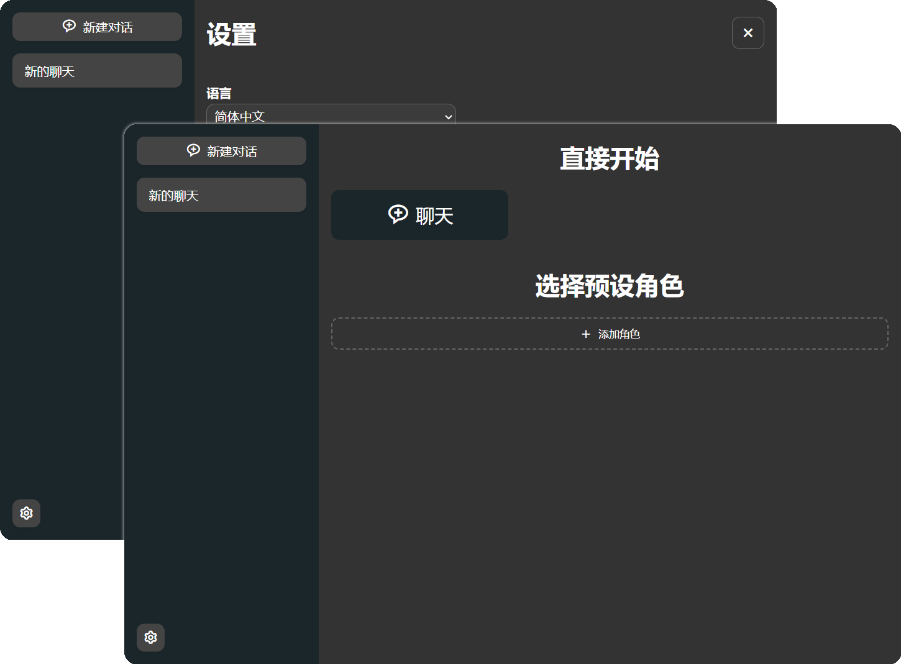

<h1 align="center">ChatGPT Web UI</h1>

这是一个使用 Nextjs + MongoDB 构建的 Chatgpt 聊天 UI。它支持多语言、明暗模式、上下文支持、并能持久性存储聊天记录。



## 功能

* 多语言
* 明暗模式
* 上下文配置
* 预设角色
* 分享聊天

## 配置

### `MONGODB_URI` （必需）

需要提供 MongoDB 连接的环境变量，类似 `"mongodb://<username>:<password>@localhost:3000/<dbname>?retryWrites=true&w=majority`

## 部署

### Vercel

[](https://vercel.com/new/clone?repository-url=https%3A%2F%2Fgithub.com%2Fbbsweb%2Fchatgpt-webui&project-name=chatgpt-webui&repository-name=chatgpt-webui)

### 自行部署

```
npm run build
```

```
npm start
```